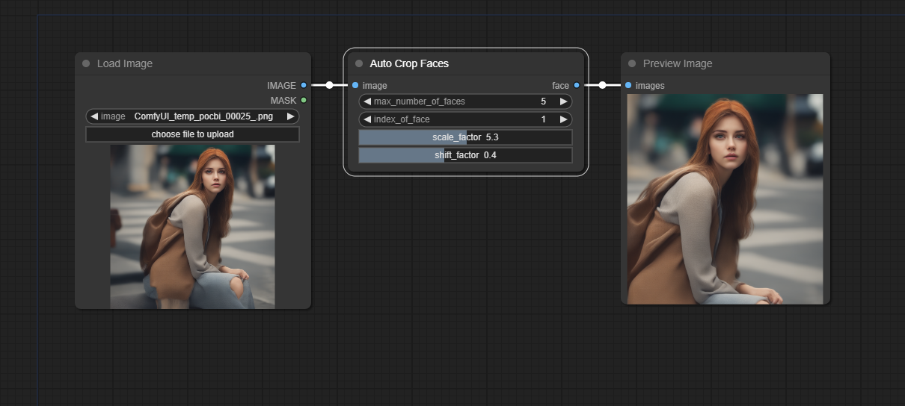
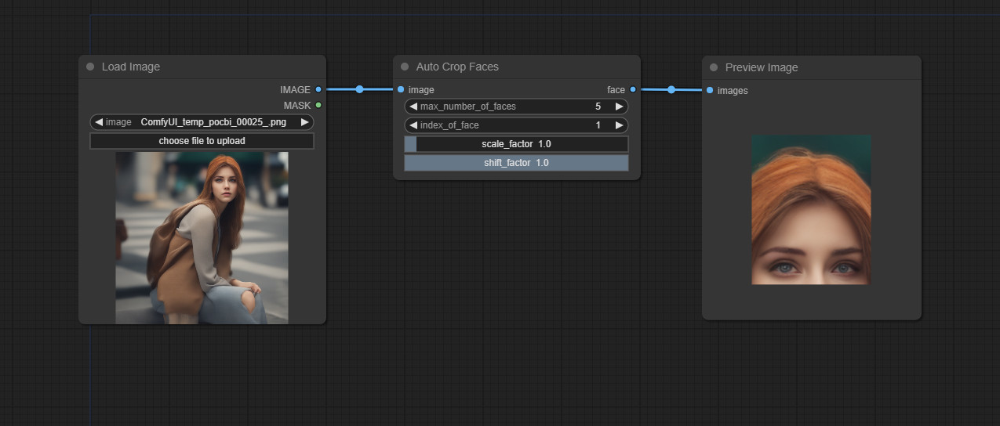
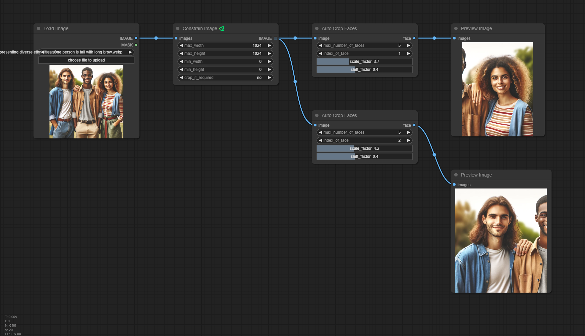
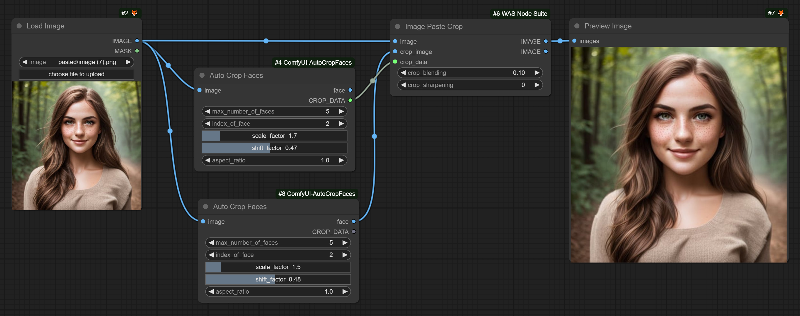

# ComfyUI-AutoCropFaces
Use RetinaFace to detect and automatically crop faces

Forked and modified from [biubug6/Pytorch_Retinaface](https://github.com/biubug6/Pytorch_Retinaface)

## Custom Nodes

### Auto Crop Faces

Detect faces and focus on one of them.

* `max_number_of_faces`: How many faces would you like to detect in total?

* `index_of_face`: Which face would you like to output? 1 for the first one. If there are fewer faces than specified, the last detected face will be output.

* `scale_factor`: How much padding would you like to add? 1 for no padding.

* `shift_factor`: Where would you like the face to be placed in the output image? Set to 0 to place the face at the top edge, 0.5 to center it, and 1.0 to place it at the bottom edge.

Recommandation:

Users might upload extremely large images, so it would be a good idea to first pass through the ["Constrain Image"](https://github.com/pythongosssss/ComfyUI-Custom-Scripts#constrain-image) node.

It now supports CROP_DATA, which is compatible with [WAS node suite](https://github.com/WASasquatch/was-node-suite-comfyui).

